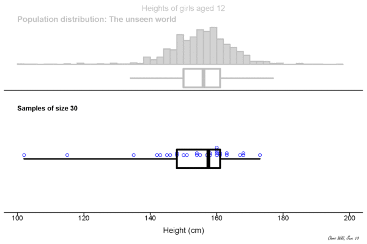
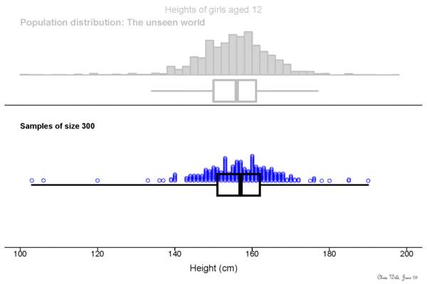
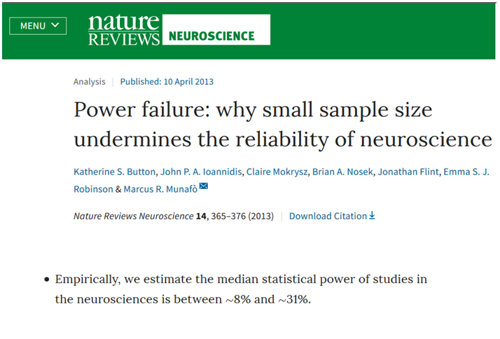

```{r setup, include=FALSE}
knitr::opts_chunk$set(echo = FALSE)
```

## What is power?

Let's start out with some nuts and bolts!

## NHST
We are working under the null hypothesis significance testing framework = the type of stats you probably learned in school

H0 is our null hypothesis.  For example...

* H0 = stats are boring

* H1 = stats are not boring

## NHST
We assess whether data are covered under the null hypothesis, and try to reject it if we can.

We do so by looking at whether the data are likely under the null hypothesis

* p-value = how likely is it that these data are true, given H0
  
The typical threshold that is set is p < 0.05

* A value with p < 0.05 is a 'significant' value

* p < 0.05 = an outcome unlikely under the null hypothesis.
  
  
## Type I error

An outcome unlikely under the null hypothesis is still *possible*  

In fact, it occurs alpha ($\alpha$)% of the time -- 5% of cases!
  
  * Type I error -- a false positive ('I found it' error)


```{r alphaPlot}
## this code is adapted from https://www.statmethods.net/advgraphs/probability.html
mean=0; sd=1; lb=1.65; ub=4

x <- seq(-4,4,length=100)*sd + mean
hx <- dnorm(x,mean,sd)
i <- x >= lb & x <= ub

plot(x, hx, type="n", xlab="", ylab="", axes=F)
lines(x, hx)
polygon(c(lb,x[i],ub), c(0,hx[i],0), col="violet") 
text(2,.02,labels=c("alpha"))
```
  
## Beta
But we care about H1 -- the alternate hypothesis. 

Comparing the distributions gives us beta ($\beta$) = the amount of the H1 curve below the $\alpha$ threshold.  

This is when we fail to reject H0 when in fact, H1 is true.

```{r alphabetaPlot}
mean=0; sd=1; lb1=1.65; ub1=4; lb2=-7; ub2=1.65

x <- seq(-4,4,length=100)*sd + mean
x2 <- x+4
hx <- dnorm(x,mean,sd)
i <- x >= lb1 & x <= ub1
j <- x2 >= lb2 & x2 <= ub2

plot(x, hx, type="l", xlab="", ylab="", axes=F,xlim=c(-3.5,7))
par(new=T)
plot(x2, hx, type="l",xlab="", ylab="", axes=F, xlim=c(-3.5,7))
polygon(c(lb1,x[i],ub1), c(0,hx[i],0), col="violet") 
polygon(c(lb2,x2[j],ub2), c(0,hx[j],0), col="lightblue") 
text(0,.2,labels=c("H0"))
text(4,.2,labels=c("H1"))
text(2,.02,labels=c("alpha"))
text(1,.02,labels=c("beta"))

```


  
## Bad betas and betta betas
$\beta$ is the false negative rate (type II or "2 bad ya missed it" error).

If H0 and H1 are very different, $\beta$ will be small
= few false negatives.

If H0 and H1 are very similar, $\beta$ will be large
 = many false negatives.
```{r betasPlot}
mean=0; sd=1; lb1=1.65; ub1=4; lb2=-7; ub2=1.65

x <- seq(-4,4,length=100)*sd + mean
x2 <- x-1
hx <- dnorm(x,mean,sd)
j <- x2 >= lb2 & x2 <= ub2
i <- x >= lb1 & x <= ub1

plot(x2, hx, type="l",xlab="", ylab="", axes=F, xlim=c(-6,3))
par(new=T)
plot(x, hx, type="l", xlab="", ylab="", axes=F,xlim=c(-6,3))
polygon(c(lb2,x2[j],ub2), c(0,hx[j],0), col="lightblue") 
polygon(c(lb1,x[i],ub1), c(0,hx[i],0), col="violet") 
text(0.5,.2,labels=c("H0"))
text(-1.5,.2,labels=c("H1"))
text(2,.02,labels=c("alpha"))
text(-1,.02,labels=c("beta"))

```

## Power is 1 - Beta
Power is mathematically defined as 1-$\beta$.  

It is the ability to correctly reject H0, the null hypothesis = to find the truth!

Maximise power by minimising false negatives.


```{r powbetaPlot}
mean=0; sd=1; lb1=1.65; ub1=8; lb2=-7; ub2=1.65; 

x <- seq(-4,4,length=100)*sd + mean
x2 <- x+4
hx <- dnorm(x,mean,sd)
i <- x >= lb1 & x <= ub1
j <- x2 >= lb2 & x2 <= ub2
k <- x2 >= lb1 & x2 <= ub1

plot(x, hx, type="l", xlab="", ylab="", axes=F,xlim=c(-3.5,7))
par(new=T)
plot(x2, hx, type="l",xlab="", ylab="", axes=F, xlim=c(-3.5,7))
polygon(c(lb2,x2[j],ub2), c(0,hx[j],0), col="lightblue") 
polygon(c(lb1,x2[k],ub1), c(0,hx[k],0), col="yellow") 
polygon(c(lb1,x[i],ub1), c(0,hx[i],0), col="violet")
text(0,.2,labels=c("H0"))
text(4,.2,labels=c("H1"))
text(2,.02,labels=c("alpha"))
text(1,.02,labels=c("beta"))
text(4,.02,labels=c("power"))

```


## Sample size and variability
Power relates to sample size because sampling is variable.

With small sample size, the estimate of the H1 mean is not very precise. 

Look at how the mean (heavy line) bounces around... This could over-inflate our power estimate. 

  

<small> https://www.stat.auckland.ac.nz/~wild/WPRH/ </small>

## Sample size and variability
With small samples, the estimate of the H1 error is also less precise.

Look at how the rectangle (interquartile interval) changes in size more on the left... This decreases power.

  

<small> https://www.stat.auckland.ac.nz/~wild/WPRH/ </small>


## Maximising power
So, to run a study with sufficient power, you need to do 2 things:

* Have an effect that is reliably different from H0 (big difference in means, small variability around them).

* Collect enough data to reliably observe the effect in H0.

# Replicability

## What is replicability?
[According to the American Statistical Association](https://www.amstat.org/asa/files/pdfs/POL-ReproducibleResearchRecommendations.pdf):

"[...]the act of repeating an entire study, independently of the original investigator without the use of original data (but generally using the same methods)."


## Power and replicability
* Low power can decrease the likelihood that a statistically significant effect is a true effect, e.g. see @ioannidis2005.

* Even when low-powered studies report true effects, their sizes tend to be exaggerated

## Example 1


For the [full article](https://www.nature.com/articles/nrn3502) see @button2013.

## Example 2


For the [full article](https://www.theatlantic.com/science/archive/2019/05/waste-1000-studies/589684/) see @yong052019.


## It's not all bad!
One way to combat these problems are Registered Reports


<small> https://cos.io/rr/ </small>

## RRs: publication bias


For the [article](https://www.nature.com/articles/d41586-018-07118-1) see @warren102018 and for the [preprint](https://psyarxiv.com/3czyt) it's based on see @allenpp2018.

## RRs: effect size estimates


For the [full article](https://www.frontiersin.org/articles/10.3389/fpsyg.2019.00813/full) see @schaefer2019.

## How to power?

* G*Power
* pwr
* simulations

* pragmatic restrictions

##  References
